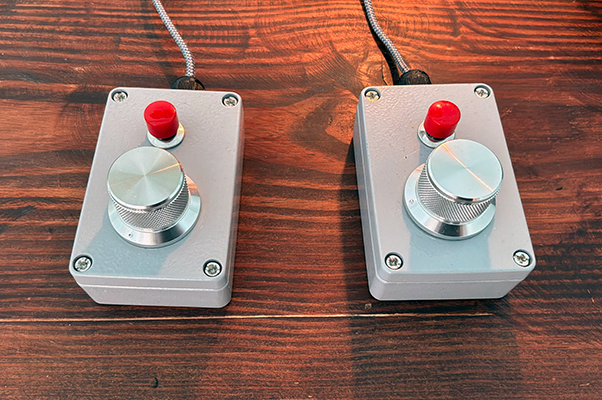
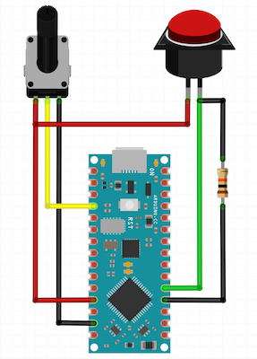
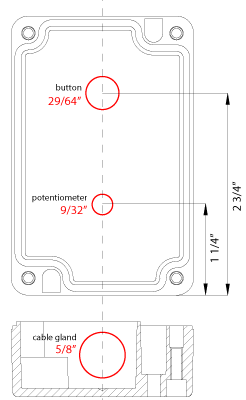

# Pong, But...


Play it here: [https://editor.p5js.org/jasoneppink/sketches/4TO1UwNmK](https://editor.p5js.org/jasoneppink/sketches/4TO1UwNmK)

## About

*Pong, But...* is a WarioWare-style adaptation of Atari's 1972 classic arcade game Pong. On each serve, players encounter a randomly-chosen variation of Pong. Variations can include shrinking paddles, fading balls, inverted input, and changed bounce behaviors. The core challenge of the game is to quickly understand the variation and adapt your gameplay accordingly.

*Pong, But...* was developed for my [p5.js](https://p5js.org/) beginner creative coding class, which is aimed at students interested in games and animation. It is designed as a culminating project that reinforces students’ understanding of classes and inheritance. When taught as outlined below, it results in a collaboratively-created, fully-playable game in as few as 3 weeks.

## Teaching Overview

For the first two weeks, students follow along as we construct a close, digital recreation of *Pong*. Care is taken to simulate the original arcade game as closely as possible, including faithfully recreating the paddle bounce behavior, increasing the ball speed as a rally continues, and incorporating recordings of original sound effects. (Dr. Hugo R. Holden’s 106-page analysis of Pong’s board logic--[ATARI PONG E circuit analysis & lawn tennis: building a digital video game with 74 series TTL IC’s](https://www.pong-story.com/LAWN_TENNIS.pdf)--is invaluable for these details.) Liberties are taken with font, timing, and (initially) player input.

Once the game is sufficiently playable, students are tasked with brainstorming 50 ideas for variations. The code we’ve written is intentionally very flexible, and ideas should emerge easily from the way we've structured it. The spare visual vocabulary of Pong helps focus students on gameplay mechanics, as opposed to visual aesthetics.

I collect students' relevant and workable ideas, we hold a draft, and in the final week(s) they work to implement their chosen variations. Each time a student finishes a variation, I quickly fold it into our  class game. As the semester comes to an end, I exhibit the final game for a few weeks in a public space.

## Schedule

Week 1:

*   [Pt 1: ball](https://github.com/jasoneppink/pong-but/blob/main/sketches/1_ball.js)
*   [Pt 2: paddles](https://github.com/jasoneppink/pong-but/blob/main/sketches/2_paddles.js)
*   [Pt 3: game, court, score](https://github.com/jasoneppink/pong-but/blob/main/sketches/3_game_court_score.js)
*   [Pt 4: states](https://github.com/jasoneppink/pong-but/blob/main/sketches/4_states.js)
*   [Pt 5: font, sound](https://github.com/jasoneppink/pong-but/blob/main/sketches/5_font_sound.js)
        
Week 2:

*   [Pt 6: advanced ball](https://github.com/jasoneppink/pong-but/blob/main/sketches/6_advanced_ball.js)
*   [Pt 7: title, serve](https://github.com/jasoneppink/pong-but/blob/main/sketches/7_title_serve.js)
        
Week 3:

*   [Pt 8: variations](https://github.com/jasoneppink/pong-but/blob/main/sketches/8_variations.js)
*   [Pt 9: controllers](https://github.com/jasoneppink/pong-but/blob/main/sketches/9_controllers.js)


##Controllers



Optional custom knob-based controllers make the game more exhibitable and allow students to understand how different input systems affect gameplay.

Materials List:

*   2x [Arduino Nano Everys](https://www.digikey.com/en/products/detail/arduino/ABX00028/10239971)
*   2x [aluminum enclosures](https://www.digikey.com/en/products/detail/rose-enclosures/010610030/2164028)
*   2x [knobs](https://www.aliexpress.us/item/2251832437890364.html)
*   2x [10K ohm linear potentiometers](https://www.amazon.com/dp/B0CZ75MLQD)
*   2x 10K ohm resistors
*   2x [small buttons](https://www.digikey.com/en/products/detail/e-switch/PS1040ARED/53842)
*   2x [PG9 cable glands](https://www.amazon.com/dp/B0DCJHYN1V)
*   2x [10ft micro USB to USB A cables](https://www.amazon.com/dp/B08HN6YTRN)
*   [Mini PC](https://www.amazon.com/dp/B0DPFFPFK4) or Raspberry Pi

Arduino Code: [Left Controller](controllers/controller_L.ino), [Right Controller](controllers/controller_R.ino)




##PC Setup
Exhibiting *Pong, But...* with controllers requires moving the game from the p5.js browser editor to a standalone browser on a computer running a local webserver. Below are detailed instructions for installing and kioskifying *Pong, But...* on a dedicated mini PC.

1. Install [Ubuntu](https://ubuntu.com/tutorials/install-ubuntu-desktop).

	*	I choose "pongbut" for both my user and computer name.

2. Set up the webserver

	*	Install Apache 2:

		`sudo apt install apache2`
	
	* 	Download the sketch and related files from p5.js (File > Download)
	*	Put the files in /var/www/html
	* 	Open http://pongbut.local in Firefox and confirm that the game starts.

3. Enable USB serial input for p5.js

	*	Plug in controllers and confirm the device names in /dev match the sketch code. They are "ttyACM0" and "ttyACM1" by default.
	
	*	Install node.js and node.js package manager:
	
		`sudo apt install nodejs npm`
	
	*	Install [p5.serialserver](https://github.com/p5-serial/p5.serialserver):
	
		`npm install p5.serialserver`
	
	*	Add pongbut to the "dialout" group so it can access serial data from the controllers:
	
		`sudo usermod -a -G dialout pongbut`
		
	*	Start the serial server:
	
		`/usr/bin/node /home/pongbut/node_modules/p5.serialserver/startserver.js`
		
	*  Reload the page in Firefox and confirm that controllers work.

4. Prepare boot script

	*	Switch the display protocol from Wayland to X11:

		`sudo nano /etc/gdm3/custom.conf`
	
		then uncomment this line:
	
		`WaylandEnable=false`
	
		(Wayland, the newer protocol, doesn't have the same automation capabilities that X11 has yet.)
	
	*	Install unclutter and xdotool:

		`sudo apt install unclutter xdotool`
	
	*	Put [pongbutstart.sh](pc/pongbutstart.sh) in ~/home/pongbut
	*	Confirm display name by running:
	
		`xrandr --listmonitors`
		
		HDMI-1 is default. Update pongbutstart.sh if necessary.

5. Make launchable icon on desktop

	*	Put [pongbutstart.desktop](pc/pongbutstart.desktop) in ~/home/pongbut/Desktop

	*	Right-click > Properties > enable Executable as Program

	*	Right-click > Allow Launching

6. Create a new service to launch on boot ([via](https://www.scalzotto.nl/posts/raspberry-pi-kiosk/)) 
	
	*	Put [pongbut.service](pc/pongbut.service) in ~/.config/systemd/user
	
	*	Add these lines to ~/.config/systemd/user/xsession.target. (Create file if it doesn't exist.):

		```
		[Unit]
		Description=Xsession running
		BindsTo=graphical-session.target
		```
	*	Add these lines to ~/.xsessionrc. (Create file if it doesn't exist.):

		```
		systemctl --user import-environment PATH DBUS_SESSION_BUS_ADDRESS
		systemctl --no-block --user start xsession.target
		```
  
	*	Run these two lines to enable and start the service:
		
		```
		systemctl --user enable pongbut
		systemctl --user start pongbut
		```
		
	*	`Alt+F4` to quit kiosk Firefox

	*	Reboot to confirm *Pong, But...* starts automatically.
